<p align="center">
  <picture>
    <source media="(prefers-color-scheme: dark)" srcset="frontend/originalMedia/brand/lockup-white.svg">
    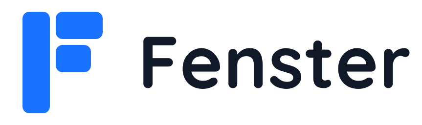
  </picture>
</p>

<p align="center">
  A calm, self-hosted to-do app with a liquid-glass interface and a real mobile app feel.
</p>

<p align="center">
  <a href="LICENSE"></a>
  <a href="https://github.com/MBeggiato/fenster/pkgs/container/fenster"></a>
</p>

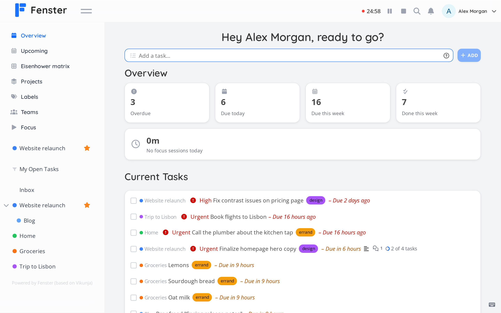

## Features

- **Multiple project views**: organize tasks in list, table, kanban, or Gantt views
- **Smart task creation**: parse dates, labels, and priority from natural language in quick-add
- **Eisenhower matrix**: categorize tasks by urgency and importance
- **Pomodoro focus timer**: focus sessions with breaks, per-task estimates and statistics
- **Installable PWA**: install on any device for a native app experience with bottom tab navigation on mobile
- **CalDAV sync**: sync tasks with calendar apps and other CalDAV clients
- **Dark mode**: switch themes automatically or manually
- **Import from other services**: migrate tasks from Todoist, Trello, Microsoft To Do, Planka, Wekan, TickTick, CSV and Vikunja exports
- **REST API**: build custom integrations with full API access

## Screenshots

### Desktop

| | |
|:---:|:---:|
| 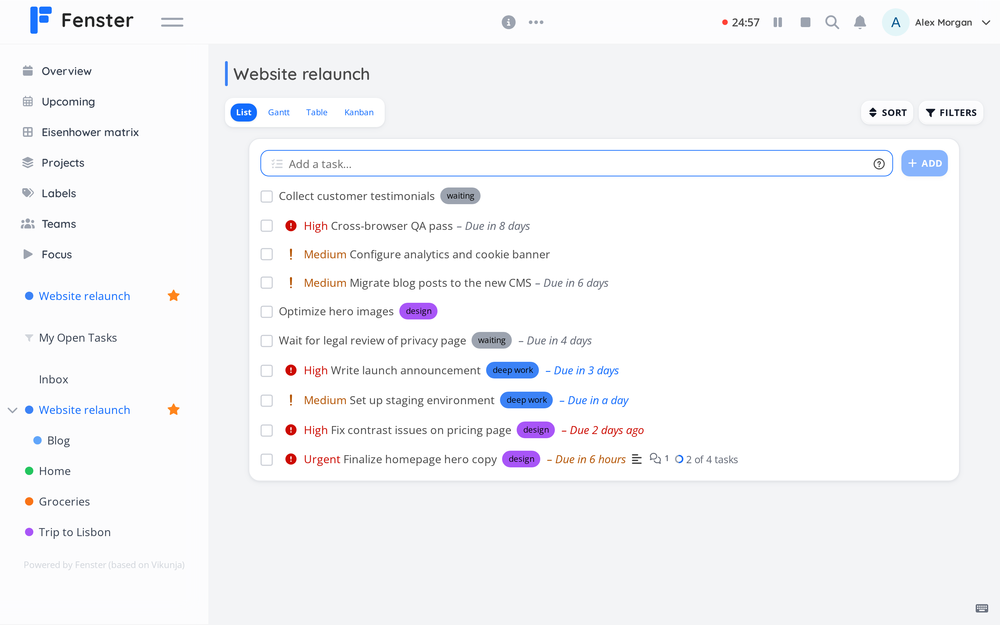 | 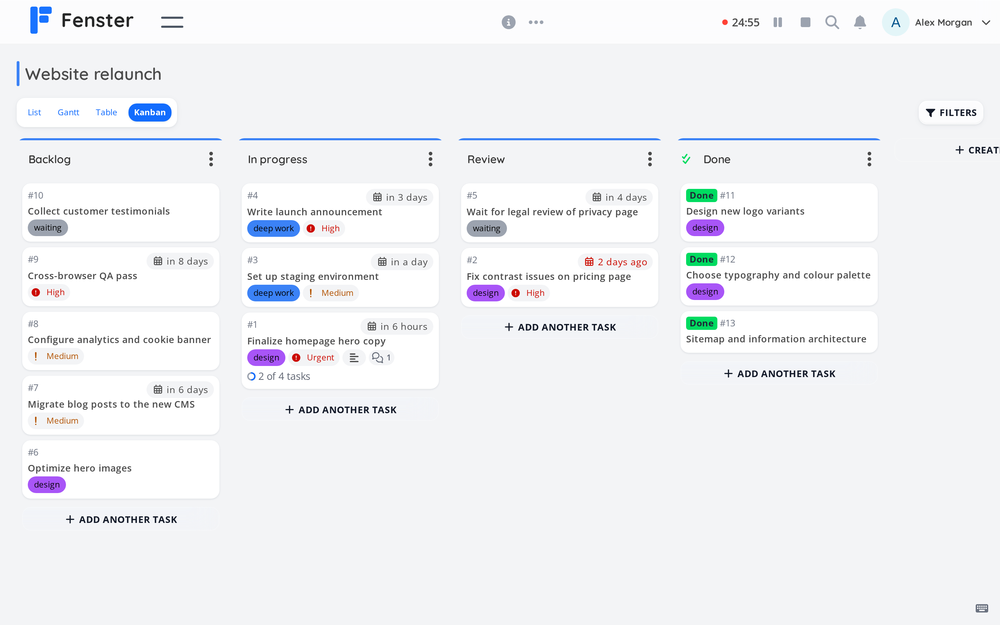 |
| 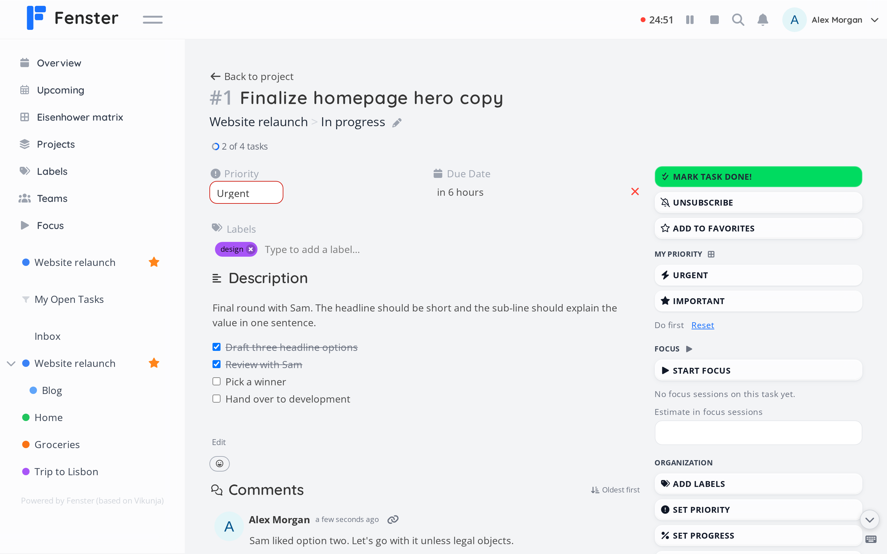 | 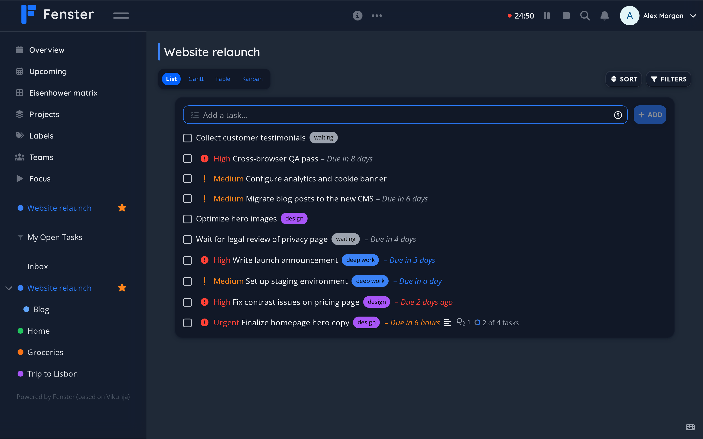 |

### Mobile

<table>
  <tr>
    <td align="center">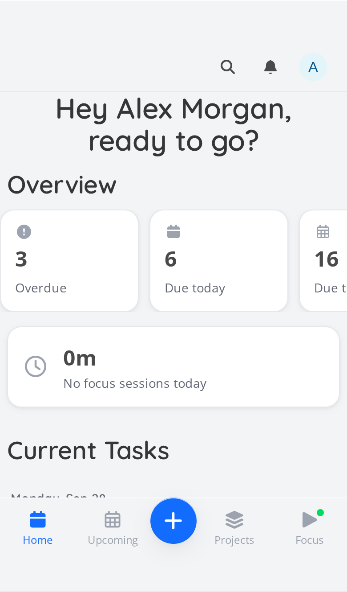<br><sub>Home</sub></td>
    <td align="center">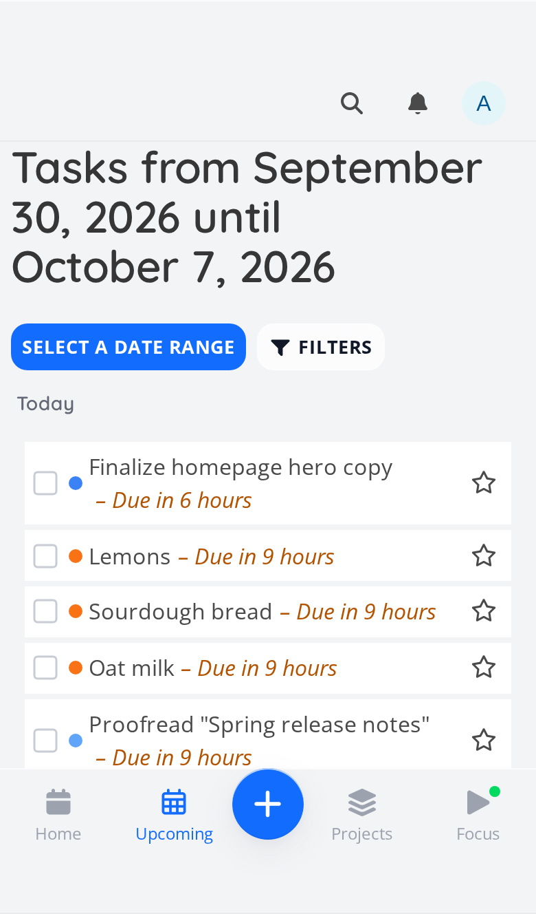<br><sub>Upcoming</sub></td>
    <td align="center">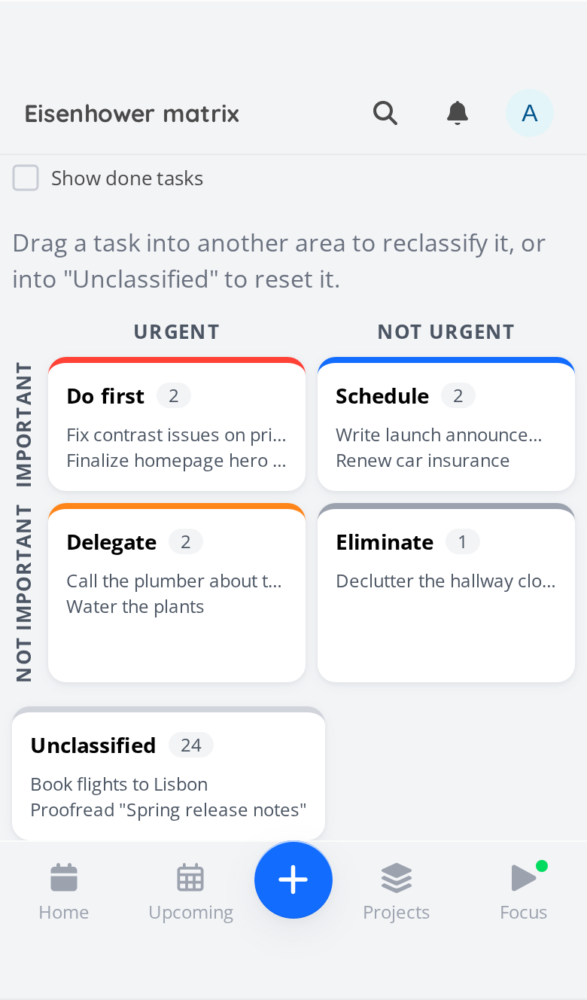<br><sub>Eisenhower matrix</sub></td>
    <td align="center">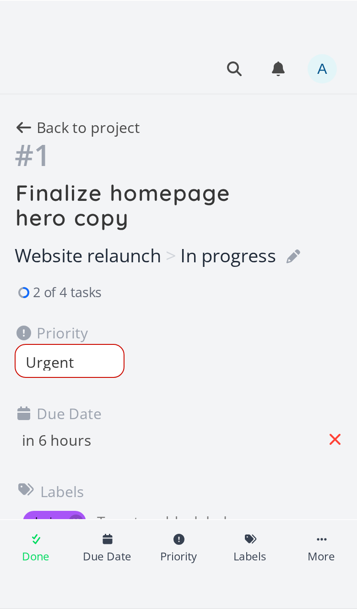<br><sub>Task</sub></td>
    <td align="center">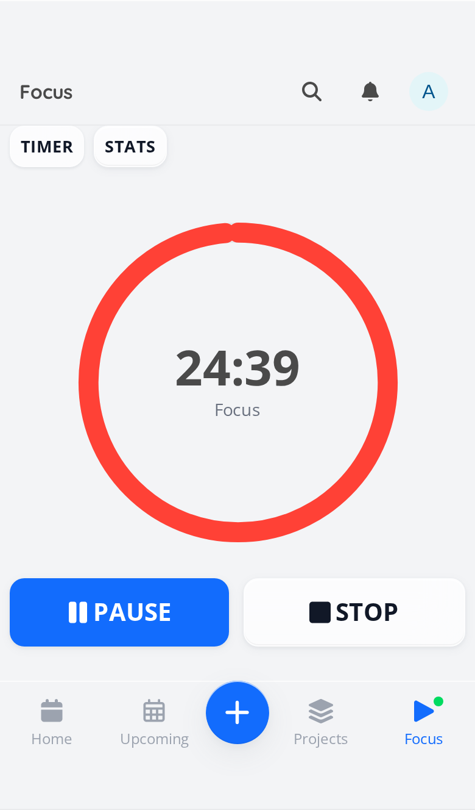<br><sub>Focus</sub></td>
  </tr>
</table>

## Quick Start (Docker)

The container runs as user `1000`, so create the data folders first and hand them to that user:

```bash
mkdir -p fenster/db fenster/files && cd fenster
sudo chown 1000 db files
docker run -p 3456:3456 -v $PWD/db:/db -v $PWD/files:/app/fenster/files \
  -e FENSTER_SERVICE_PUBLICURL=http://localhost:3456 \
  -e FENSTER_SERVICE_SECRET=change-me \
  ghcr.io/mbeggiato/fenster:latest
```

Then open http://localhost:3456 and register the first account.

**Docker Compose** (same folders):

```yaml
services:
  fenster:
    image: ghcr.io/mbeggiato/fenster:latest
    ports:
      - "3456:3456"
    volumes:
      - ./db:/db
      - ./files:/app/fenster/files
    environment:
      FENSTER_SERVICE_PUBLICURL: https://tasks.example.com
      FENSTER_SERVICE_SECRET: change-me
    restart: unless-stopped
```

Configuration uses `FENSTER_*` environment variables, see [vikunja.io/docs/config-options](https://vikunja.io/docs/config-options/) for the option names (replace the `VIKUNJA_` prefix with `FENSTER_`).

**Migrating from the Vikunja names:** the old names keep working, with a warning in the log, until 2027-03-31 ([#15](https://github.com/MBeggiato/fenster/issues/15)):

- `VIKUNJA_*` env vars are now `FENSTER_*` (`FENSTER_*` wins if both are set)
- config file dirs `/etc/vikunja/` and `~/.config/vikunja` are now `/etc/fenster/` and `~/.config/fenster`
- SQLite file `vikunja.db` is now `fenster.db` (an existing `vikunja.db` next to it is used if `fenster.db` is missing). To rename it, stop the container first (`docker stop`, not `docker rm -f`) and rename `vikunja.db-wal` and `vikunja.db-shm` along with it, otherwise recent changes are lost
- Docker files mount `/app/vikunja/files` is now `/app/fenster/files`; DB mount stays `/db`
- binary `vikunja` is now `fenster`

## Build from Source

Source: https://github.com/MBeggiato/fenster

```bash
git clone https://github.com/MBeggiato/fenster.git
cd fenster
docker build -t fenster .
```

For build and development commands, see [CONTRIBUTING.md](CONTRIBUTING.md).
Vikunja documentation (increasingly differs from Fenster): [vikunja.io/docs](https://vikunja.io/docs/).

## Regenerating the screenshots

Screenshots are generated with demo data by `frontend/scripts/readme-screenshots/run.sh`.

## Based on Vikunja

Fenster started as a fork of [Vikunja](https://github.com/go-vikunja/vikunja) ([vikunja.io](https://vikunja.io)) and has been developed independently since September 2026; upstream changes are no longer merged.
Thanks to the Vikunja maintainers and all Vikunja contributors, whose work this project builds on.
Fenster is independent and not affiliated with or endorsed by the Vikunja project. See [NOTICE](NOTICE).
Coming from Vikunja? See [Migrating from Vikunja](docs/migrating-from-vikunja.md).

## Contributing

See [CONTRIBUTING.md](CONTRIBUTING.md).

## Security Reports

Please report security issues privately through the
[GitHub security advisories](https://github.com/MBeggiato/fenster/security/advisories/new) of this repository.

## License

Licensed under [AGPL-3.0-or-later](LICENSE). Original work Copyright 2018-present Vikunja and contributors;
modifications Copyright 2026 Marcel Beggiato. See [NOTICE](NOTICE).

### Unsplash Images

Background images from Unsplash are distributed under the [Unsplash License](https://unsplash.com/license). The license requires giving credit to the photographer and Unsplash. See [Unsplash's terms](https://unsplash.com/terms). Other third-party notices are in [NOTICE](NOTICE).
